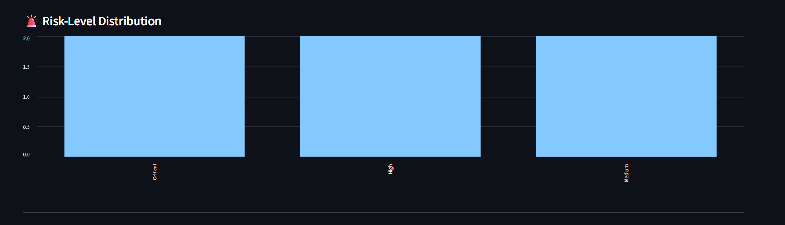

# RiskPulse AI — S&P Global & CRISIL Campus Hackathon 2026

**Project:** AI/NLP Financial Risk Intelligence Engine + Strategic Portfolio Stress Testing  
**Candidate Name:** Akankshya Dibyadarsinee Rout  
**College Email ID:** akankshya.24bai10724@vitbhopal.ac.in
**College / Campus:** VIT BHOPAL UNIVERSITY/ Bhopal Campus
**Demo Video Link:** [YouTube / Unlisted]
**Slide Deck:** [View Presentation Deck](docs/vitb_Akankshya_hackathon.pptx)

**Repository:**  
https://github.com/Akankshya-35-45/VIT_BHOPAL_UNIVERSITY-Akankshya_Dibyadarsinee_Rout-hackathon

**Demo Video:**  
_Add the final unlisted YouTube link before submission._

**Presentation:**  
`docs/presentation.pdf`

---

## 1. Project Overview

Financial risk can emerge first as unstructured information from breaking news, market commentary, and social-media discussion. Converting these text streams into structured risk indicators is challenging because the information is heterogeneous, noisy, and difficult to process manually at scale.

**RiskPulse AI** is a financial risk intelligence and portfolio stress-testing prototype that converts unstructured financial text into structured risk signals and connects those signals to a strategic portfolio stress-testing workflow.

The prototype uses a hybrid NLP pipeline to process financial text. It can ingest public GDELT news, optionally use NewsAPI when configured, and combine these sources with a synthetic social-media feed included in the repository.

Each text item is transformed into:

- Sentiment score
- Sentiment label
- Event classification
- Event confidence
- Impact score
- Overall risk score
- Risk level
- Explainable rationale

The downstream application is **Module B: Strategic Portfolio Stress Testing**. When a high-impact event crosses a configurable trigger threshold, the system applies transparent, event-specific synthetic shocks to a portfolio containing equities, bonds, loans, and derivatives.

The dashboard displays portfolio value before and after the scenario, simulated P&L, percentage loss, and asset-level impact.

> **Note:** All portfolio values, stress-test shocks, and scenario assumptions are synthetic and are used only for hackathon demonstration purposes. The system is not investment advice.

---

## 2. Problem Statement

Financial institutions and analysts receive large amounts of information from news, market commentary, and other text-based sources.

The challenge is to:

1. Detect financially relevant events from unstructured text.
2. Determine the sentiment and potential impact of those events.
3. Convert the information into structured risk signals.
4. Identify high-impact events using a configurable risk threshold.
5. Connect those events to portfolio-level stress testing.
6. Present the resulting impact in an interpretable dashboard.

RiskPulse AI addresses this workflow through a single prototype.

---

## 3. Solution Approach

The overall workflow is:

```text
GDELT / Optional NewsAPI / Synthetic Social Feed
                    |
                    v
             Data Ingestion
                    |
                    v
            Text Normalization
                    |
                    v
             NLP Risk Engine
              /      |      \
             /       |       \
      Sentiment    Event     Impact
      Analysis   Classification Score
             \       |       /
              \      |      /
                Risk Signal
                    |
                    v
          High-Impact Trigger
                    |
                    v
       Strategic Stress Testing
                    |
                    v
        Scenario-Specific Shocks
                    |
                    v
         Portfolio Revaluation
                    |
                    v
          Streamlit Dashboard
```

The system focuses on transparency and explainability. Each risk signal can be inspected through its underlying text, detected event category, sentiment, impact score, and rationale.

---

## 4. System Architecture

```text
+-----------------------------+
|        Data Sources         |
|                             |
| GDELT                       |
| Optional NewsAPI            |
| Synthetic Social Feed       |
+--------------+--------------+
               |
               v
+-----------------------------+
|       Data Ingestion        |
|                             |
| Fetch                        |
| Normalize                    |
| Source / Entity Metadata    |
+--------------+--------------+
               |
               v
+-----------------------------+
|       NLP Risk Engine       |
|                             |
| VADER Sentiment             |
| Event Classification        |
| Impact Scoring              |
| Risk Scoring                |
+--------------+--------------+
               |
               v
+-----------------------------+
|        Risk Signals         |
|                             |
| Sentiment                   |
| Event                       |
| Confidence                  |
| Impact                      |
| Risk Level                  |
| Rationale                   |
+--------------+--------------+
               |
               v
+-----------------------------+
|      Stress-Test Trigger    |
|                             |
| Configurable Risk Threshold |
+--------------+--------------+
               |
               v
+-----------------------------+
|   Portfolio Stress Engine   |
|                             |
| Event-Specific Shocks       |
| Asset-Level Revaluation     |
+--------------+--------------+
               |
               v
+-----------------------------+
|      Streamlit Dashboard    |
|                             |
| Risk Signals                |
| Event Distribution          |
| Risk Distribution           |
| Stress-Test Results         |
| Portfolio Impact            |
+-----------------------------+
```

### Architecture Diagram

The repository also contains the visual architecture diagram:

`docs/architecture.png`

---

## 5. Technology Stack

- **Python 3.11+**
- **Streamlit** — interactive financial risk dashboard
- **FastAPI** — API interface for risk analysis
- **Pandas** — data processing and portfolio calculations
- **VADER Sentiment** — sentiment analysis
- **Hybrid Keyword Classification** — financial event detection
- **GDELT** — public news ingestion
- **NewsAPI** — optional additional news source
- **CSV** — synthetic demonstration datasets
- **Git / GitHub** — version control and submission

---

## 6. Risk Intelligence Engine

The core risk engine converts unstructured text into a structured `RiskSignal`.

Each signal contains:

```text
Source
Entity
Original Text
Sentiment Score
Sentiment Label
Event Classification
Event Confidence
Impact Score
Risk Score
Risk Level
Rationale
```

### Supported Event Categories

```text
Geopolitical
Macroeconomic
Credit Event
Merger/Acquisition
Product Launch
Regulatory
Earnings
Other
```

### Example Input

```text
Bank announces a major credit downgrade after liquidity pressure.
```

### Example Structured Signal

```text
Event: Credit Event
Sentiment: Negative
Impact Score: High
Risk Level: High / Critical
Rationale: Credit Event detected with strong classification confidence.
```

The event classification and impact calculation are intentionally transparent so that the output can be inspected and explained during the hackathon demonstration.

---

## 7. Strategic Portfolio Stress Testing

The second module connects detected financial events to portfolio-level scenario analysis.

The prototype uses a synthetic portfolio containing:

- Equities
- Bonds
- Loans
- Derivatives

Each event category has an illustrative shock profile.

Example:

```text
Geopolitical Event
       |
       +----> Equity Shock
       |
       +----> Bond Shock
       |
       +----> Loan Shock
       |
       +----> Derivative Shock
```

The scenario impact score scales the base shock applied to the portfolio.

### Stress-Test Workflow

```text
Portfolio Before
       |
       v
Scenario Event
       |
       v
Scenario Impact Score
       |
       v
Asset-Specific Shock
       |
       v
Stressed Asset Values
       |
       v
Portfolio After
       |
       v
Simulated P&L
       |
       v
Loss %
```

The dashboard also displays asset-level stress-test results.

---

## 8. Dashboard

The Streamlit dashboard provides an interactive interface for financial risk analysis and strategic portfolio stress testing.

### Risk Engine Controls

The sidebar provides:

- Stress-test trigger threshold
- Event filter
- Refresh live feeds

### Risk Intelligence Dashboard

The dashboard displays:

- Signals processed
- Average risk score
- High/Critical signals
- Entities monitored
- Detected event classifications
- Sentiment labels
- Event confidence
- Impact scores
- Risk scores
- Risk levels
- Explainable rationale

### Event Distribution

The dashboard displays the distribution of detected event categories, including:

- Credit Event
- Earnings
- Geopolitical
- Macroeconomic
- Merger/Acquisition
- Product Launch
- Regulatory

### Risk-Level Distribution

Risk signals are grouped into:

- Critical
- High
- Medium
- Low

### Strategic Portfolio Stress Testing

Users can select:

- Scenario event
- Scenario impact score

The dashboard then calculates and displays:

- Portfolio Before
- Portfolio After
- Simulated P&L
- Loss %
- Portfolio Impact by Asset
- Asset-level Stress-Test Results

---

## 9. Dashboard Screenshots

### AI/NLP Risk Intelligence

The dashboard provides a structured view of detected financial risk signals.


### Strategic Portfolio Stress Testing

The stress-testing module displays portfolio-level and asset-level scenario impact.


> If these screenshot files are not included in `docs/`, remove the image references above or add the corresponding screenshots to the folder.

---

## 10. API

RiskPulse AI also exposes the risk engine through a FastAPI endpoint.

### Start the API

```bash
uvicorn src.api:app --reload
```

### Example Request

```json
{
  "text": "Bank announces a major credit downgrade after liquidity pressure.",
  "source": "demo",
  "entity": "GlobalBank"
}
```

The API returns structured risk information including:

- Sentiment
- Event classification
- Event confidence
- Impact score
- Risk score
- Risk level
- Rationale

---

## 11. Dataset Used

The project uses synthetic and publicly available data.

### GDELT

GDELT is used as a public news source for live news ingestion.

The prototype can retrieve public news articles and process their textual content through the risk engine.

### NewsAPI

NewsAPI is supported as an optional additional news source.

It requires an API key and is not required for the core demonstration.

If NewsAPI is not configured, the application can continue using the available public and synthetic sources.

### Synthetic Social-Media Dataset

The repository contains:

```text
data/social_posts.csv
```

This dataset contains synthetic records created specifically for demonstration and reproducibility.

No confidential social-media or client information is used.

### Synthetic Portfolio Dataset

The repository contains:

```text
data/portfolio.csv
```

The portfolio contains synthetic asset records representing:

- Equities
- Bonds
- Loans
- Derivatives

### Data Assumptions

The prototype assumes:

- Portfolio values are synthetic.
- Scenario shocks are illustrative.
- Event keywords represent predefined financial risk categories.
- Sentiment is one component of risk rather than a complete measure of financial risk.
- Stress-test results represent simulated scenarios rather than market forecasts.

---

## 12. Quickstart & Installation

### Runtime

```text
Python 3.11+
```

### Clone the Repository

```bash
git clone https://github.com/Akankshya-35-45/VIT_BHOPAL_UNIVERSITY-Akankshya_Dibyadarsinee_Rout-hackathon.git
```

### Enter the Repository

```bash
cd VIT_BHOPAL_UNIVERSITY-Akankshya_Dibyadarsinee_Rout-hackathon
```

### Create Virtual Environment

```bash
python -m venv .venv
```

### Activate on Windows

```bash
.venv\Scripts\activate
```

### Install Dependencies

```bash
pip install -r requirements.txt
```

### Run the Streamlit Dashboard

```bash
streamlit run app.py
```

The dashboard will normally be available at:

```text
http://localhost:8501
```

---

## 13. Optional NewsAPI Configuration

NewsAPI is optional.

Create a local `.env` file from the provided example.

### Windows

```bash
copy .env.example .env
```

Then add:

```text
NEWSAPI_KEY=your_api_key_here
```

Do not commit the API key to GitHub.

The `.env` file should remain excluded through `.gitignore`.

The core prototype remains usable without NewsAPI.

---

## 14. Repository Structure

```text
VIT_BHOPAL_UNIVERSITY-Akankshya_Dibyadarsinee_Rout-hackathon/
│
├── README.md
├── requirements.txt
├── LICENSE
├── .gitignore
├── .env.example
├── app.py
│
├── src/
│   ├── risk_engine.py
│   ├── ingestion.py
│   ├── stress_test.py
│   └── api.py
│
├── data/
│   ├── social_posts.csv
│   └── portfolio.csv
│
└── docs/
    ├── presentation.pdf
    ├── architecture.png
    ├── risk-intelligence.png
    └── portfolio-stress-testing.png
```

---

## 15. Key Results & Prototype Demonstration

The current prototype demonstrates the following end-to-end workflow.

### 1. Multi-Source Data Ingestion

The system can process:

- Public news data
- Optional NewsAPI data
- Synthetic social-media data

### 2. NLP Risk Extraction

Each text record is transformed into:

```text
Sentiment
Event Type
Event Confidence
Impact Score
Risk Score
Risk Level
Rationale
```

### 3. Configurable Stress Trigger

The dashboard allows the user to configure the threshold used to activate the stress-testing workflow.

### 4. Event-Driven Scenario Analysis

A detected event can trigger scenarios such as:

```text
Geopolitical
Macroeconomic
Credit Event
Regulatory
Merger/Acquisition
Product Launch
Earnings
```

### 5. Portfolio-Level Analysis

The system calculates:

```text
Portfolio Before
Portfolio After
Simulated P&L
Loss %
```

### 6. Asset-Level Analysis

The dashboard shows how individual assets respond to the selected scenario.

The overall flow is:

```text
Unstructured Information
          |
          v
      Risk Signal
          |
          v
       Scenario
          |
          v
   Portfolio Impact
```

---

## 16. Domain Impact

RiskPulse AI demonstrates how unstructured information can be connected to structured portfolio risk analysis.

Potential applications include:

- Financial risk monitoring
- Portfolio stress testing
- Credit-risk monitoring
- Event-driven risk analysis
- Market intelligence
- Early-warning systems
- Scenario analysis
- Risk dashboards for analysts

The key design principle is **explainability**.

Instead of producing only a single opaque prediction, the prototype exposes the intermediate signals that contribute to the scenario:

```text
Text
 |
 v
Sentiment
 |
 v
Event Classification
 |
 v
Impact Score
 |
 v
Risk Level
 |
 v
Stress Scenario
 |
 v
Portfolio Impact
```

This makes the prototype easier to inspect, demonstrate, and extend.

---

## 17. Limitations

The current implementation is an MVP and has several limitations.

### NLP Limitations

The event classifier currently uses domain-specific keywords rather than a trained financial language model.

### Sentiment Limitations

VADER is a general-purpose sentiment analyzer and may not fully capture:

- Financial terminology
- Sarcasm
- Complex disclosures
- Market-specific language
- Context-dependent financial sentiment

### Scenario Limitations

The portfolio stress shocks are synthetic assumptions created specifically for demonstration.

They should not be interpreted as real market forecasts.

### Data Limitations

The social-media dataset is synthetic.

Live news availability may vary depending on external API and network availability.

### Risk Calibration

The current scoring system is rule-based and has not been calibrated against a historical labeled financial-risk dataset.

---

## 18. Future Enhancements

Future versions could include:

- Fine-tuned FinBERT or another financial language model
- Financial named-entity recognition
- Company and sector exposure mapping
- Historical event-risk datasets
- Risk-score calibration
- Event deduplication
- Streaming ingestion using Kafka
- Real-time alerting
- Time-series risk tracking
- Portfolio concentration analysis
- Correlation-aware stress testing
- Monte Carlo scenario simulation
- Value-at-Risk
- Expected Shortfall
- Model monitoring
- Explainable AI dashboards
- Database-backed historical risk storage

---

## 19. Reproducibility

The repository contains the synthetic datasets required to demonstrate the core workflow.

The portfolio stress-testing module remains reproducible even if external live-news sources are temporarily unavailable.
The synthetic datasets allow the core demonstration to be executed locally without requiring confidential or proprietary information.

---

## 20. Responsible Data Usage

This project follows the hackathon requirement of avoiding confidential client information.
No confidential S&P Global or CRISIL data is used.

The project uses:
- Publicly available news data
- Synthetic social-media data
- Synthetic portfolio data
- Synthetic scenario assumptions

The stress-test results are for demonstration purposes only.

---

## 21. Demo Video

**Demo Video:**  
_Add the final unlisted YouTube URL here before submission._

Recommended demonstration flow:

```text
1. Introduce RiskPulse AI
2. Explain the financial risk problem
3. Start the application
4. Show the Risk Engine dashboard
5. Show Event Distribution
6. Show Risk-Level Distribution
7. Select a stress-test scenario
8. Adjust the impact score
9. Run the stress test
10. Show Portfolio Before / After
11. Show Simulated P&L
12. Show Asset-Level Impact
13. Explain the domain impact
14. Explain limitations and future work
```

The final video should demonstrate the complete workflow and should be uploaded to YouTube as **Unlisted**.

The video link should be tested before final submission.

---

## 22. Presentation Deck

The presentation deck is provided in:

```text
docs/presentation.pdf
```

Recommended structure:

```text
Slide 1 - Title
Slide 2 - Problem & Approach
Slide 3 - System Architecture
Slide 4 - Implementation Highlights
Slide 5 - Key Results
Slide 6 - Domain Impact
Slide 7 - Limitations & Next Steps
```

---




## 23. Architecture Diagram

The architecture diagram is provided in:

```text
docs/architecture.png
docs/RiskPulse AI System Architecture.png
```

The diagram represents:

```text
Data Sources
     |
     v
Data Ingestion
     |
     v
NLP Risk Engine
     |
     v
Risk Signals
     |
     v
Stress Trigger
     |
     v
Scenario Engine
     |
     v
Portfolio Stress Test
     |
     v
Dashboard
```

---

## 24. Academic / AI Usage

AI assistance was used during development of the prototype.

The candidate reviewed and integrated the implementation, tested the application locally, made project-specific design decisions, and is responsible for the final submitted work.

All external/public data sources and synthetic assumptions are documented in this repository.

---

## 25. Resume-Ready Project Summary

**RiskPulse AI — Financial Risk Intelligence & Portfolio Stress Testing**

Built a hybrid NLP financial risk intelligence engine using VADER sentiment analysis, domain event classification, and impact scoring to convert unstructured financial text into structured risk signals; developed an event-driven strategic portfolio stress-testing workflow using Streamlit and Pandas, and exposed the risk engine through FastAPI for downstream applications.

### Key Technologies

```text
Python
Streamlit
FastAPI
Pandas
VADER
NLP
Financial Risk Analysis
Portfolio Stress Testing
GDELT
Synthetic Data
Git/GitHub
```

---

## 26. Submission Checklist

### GitHub Repository

- [ ] Repository is Public
- [ ] README.md is present
- [ ] requirements.txt is present
- [ ] LICENSE is present
- [ ] Source code is present
- [ ] Synthetic data is present
- [ ] Architecture diagram is present
- [ ] Presentation PDF is present
- [ ] Dashboard screenshots are present
- [ ] No API keys are committed
- [ ] No confidential data is included

### Application

- [ ] `streamlit run app.py` works
- [ ] Dashboard loads successfully
- [ ] Risk engine produces signals
- [ ] Stress testing works
- [ ] Portfolio results are displayed
- [ ] Asset-level results are displayed
- [ ] FastAPI endpoint works

### Presentation

- [ ] Problem explained
- [ ] Approach explained
- [ ] Architecture shown
- [ ] Implementation explained
- [ ] Results shown
- [ ] Domain impact explained
- [ ] Limitations included
- [ ] Future enhancements included

### Demo Video

- [ ] Approximately 10 minutes
- [ ] End-to-end workflow demonstrated
- [ ] Application shown running
- [ ] Risk engine demonstrated
- [ ] Stress-test scenario demonstrated
- [ ] Portfolio impact explained
- [ ] YouTube video set to Unlisted
- [ ] Video link added to README
- [ ] Video tested before submission

### Final Submission

- [ ] Public GitHub repository link copied
- [ ] YouTube demo link copied
- [ ] Presentation PDF included
- [ ] Architecture PNG included
- [ ] Dashboard screenshots included
- [ ] All required files committed
- [ ] Final `git push` completed
- [ ] Submission form completed before deadline

---

## 27. Disclaimer

RiskPulse AI is a hackathon prototype developed for educational and demonstration purposes.

The portfolio values, scenario shocks, risk scores, and simulated P&L are based on synthetic data and illustrative assumptions.

The system does not provide investment advice, trading recommendations, credit ratings, or financial forecasts.

---

## Project Repository

https://github.com/Akankshya-35-45/VIT_BHOPAL_UNIVERSITY-Akankshya_Dibyadarsinee_Rout-hackathon
